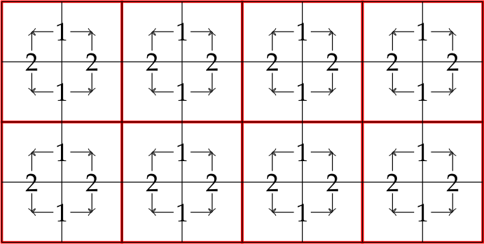

# Week 7 - Block Automata

## Suggested Reading

None.

### Going Beyond

* [Cellular Automata](https://cell-auto.com/) by Tim Tyler, e.g., [the page on
  Margolus neighbourhoods](https://cell-auto.com/neighbourhood/margolus/).

## Exercises

In these exercises you will develop a set of functions for evaluating *block
cellular automata* that are parameterised over the evaluation rules, as well as
a set of evaluation rules that involve nontrivial state management within each
cell. **You will make use of these techniques at the exam.**

### Cellular Automata

A two-dimensional *cellular automaton* is a model of computation where the
computation is structured as a grid of *cells*, each of which contain some
state. Computation occurs by each cell interacting with its neighbours through
some rule. Conway's Game of Life is an example of a cellular automaton that you
may be familiar with. For our purposes, each cell interacts only with its
immediate (non-diagonal) neighbours.

A [*block cellular
automaton*](https://en.wikipedia.org/wiki/Block_cellular_automaton) is a variant
of cellular automatons where the grid is partitioned into non-overlapping blocks
and interactions take place only for the cells inside each block. By regularly
shifting the partition of the grid into blocks, a cell still gets to eventually
interact with all of its neighbours. Block cellular automatons are useful when
the interactions are complicated or involve physical properties - for example,
they are commonly used for [falling-sand
games](https://en.wikipedia.org/wiki/Falling-sand_game). For these exercises we
use the [*Margolus
neighbourhood*](https://en.wikipedia.org/wiki/Block_cellular_automaton#Neighborhoods)
partitioning scheme, which is demonstrated below. Note that we assume a world
shaped like a torus (or donut), where the neighbours of a cell at the edges are
found by wrapping around to the opposite edge.


The numbers serve only to identify which cells belong to the same
neighbourhood---this is significant only in the odd case, where the
neighbourhoods wrap around the edges of the grid.

**Note:** Margolus neighbourhoods are only well-defined when the grid size is an
even number in both dimensions. For these exercises we will assume that this is
always the case. For that matter, we will also assume that the grid always has a
width and height greater than zero.

For each iteration and partioning of the grid into Margolus neighbourhoods, each
neighbourhood is updated as follows:

1. The upper left cell interacts with the upper right cell, and the lower left
  cell interacts with the lower right cell.
2. The upper left cell interacts with the lower left cell, and the upper right
  cell interacts with the lower right cell.

This is shown in the image below.



At the end of each iteration, the partitioning shifts by one. Note that this
allows some concurrency within each Margolous neighbourhood, and more
importantly, it also allows each neighbourhood to be updated independently.

As always, you will be working from a [code handout](handout/), and there are
[solutions](solutions/) available. The handout is completely skeletal, with
nothing to explain.

### Basic infrastructure

For the following you will be adding code to the `BlockAutomaton.Rules` module.

A grid cell can be identified with a pair *(i,j)* of a row and column coordinate
respectively (note that this differs from normal *x/y* convention). However, we
also need a datatype for representing the position of a cell within its Margolus
neighbourhood (upper-left, upper-right, lower-left, lower-right):

```Haskell
data MargolusPos = UL | UR | LL | LR
  deriving (Eq, Show)
```

Now define a function

```Haskell
margolusInitial :: (Int, Int) -> MargolusPos
```

that given an initial position *(i,j)* of a cell determines its Margolus
position (assume an even iteration, i.e., the red grid above).

<details> <summary>Open this to see the answer</summary>

```Haskell
margolusInitial :: (Int, Int) -> MargolusPos
margolusInitial (i, j) =
  case (i `mod` 2, j `mod` 2) of
    (0, 0) -> UL
    (0, 1) -> UR
    (1, 0) -> LL
    _ -> LR
```

</details>

Note that as the Margolus neighbourhood shifts, each cells' Margolus position is
mirrored across the centre. For example, a cell in position `UL` in one
iteration will be in position `LR` in the next iteration, and then flip back to
`UL` in the iteration after that. Write a function

```Haskell
margolusShift :: MargolusPos -> MargolusPos
```

that performs this transformation.

<details> <summary>Open this to see the answer</summary>

```Haskell
margolusShift :: MargolusPos -> MargolusPos
margolusShift UL = LR
margolusShift LR = UL
margolusShift UR = LL
margolusShift LL = UR
```

</details>

### Interaction rules

The evolution of a cellular automaton is defined by the interaction function
that determines what happens when two cells interact. For convenience, we will
also require two other functions: one for observing the external state of the
automaton (e.g. for visualisation), and one for initialising the cells of the
grid when the automaton starts. We encapsulate this in a type `Rules state obs`,
which we also define in `BlockAutomaton.Rules`:

```Haskell
data Rules state obs = Rules
  { rulesInitial :: (Int, Int) -> state,
    rulesInteract :: (state, state) -> (state, state),
    rulesObserve :: state -> obs
  }
```

A `Rules state obs` describes a cellular automaton where cells contain values of
type `state`, and the observable result of evaluation is `obs`.

* `rulesInitial` is passed the initial coordinate of a cell, and returns the
  initial state.

* `rulesInteract` is passed two cell states and returns two new states (in the
  same order as the arguments).

* `rulesObserve` is passed a cell state and returns some observable data. In
  some cases this may be the same as the entire cell state, but often this is
  some kind of representative value of the cell state (e.g., in our most fancy
  ruleset, this will be an RGB colour we can use to visualise the grid).

Now define an interaction ruleset where cell states are `Doubles` and the
observables are `Int`

```Haskell
smoothen :: Rules Double Int
```

such that

* Each cell *(i,j)* initially has the value *i+j* (as a `Double`).

* When two cells interact, they each end up with a state that is half of their
  summed states (i.e., take the average of the two states).

* Observation is by rounding the `Double` to an `Int`.


<details> <summary>Open this to see the answer</summary>

```Haskell
smoothen :: Rules Double Int
smoothen =
  Rules
    { rulesInitial = \(i, j) -> fromIntegral $ i + j,
      rulesInteract = \(x, y) -> ((x + y) / 2, (x + y) / 2),
      rulesObserve = round
    }
```

</details>

Finally, make sure the following things are exported from `BlockAutomaton.Rules`:

```Haskell
  ( Rules (..),
    MargolusPos (..),
    margolusInitial,
    margolusShift,
  )
```

### A Grid Abstraction

Now we move on to implementing the module `BlockAutomaton.Simulation`.

Before we can implement the execution of a block automaton, we will build a
small abstraction for torus/donut-shaped grids. This will take the form of a
type `Grid a`, representing grids where each cell contains an `a`. For
simplicity, our grid is just a list of lists:

```Haskell
type Grid a = [[a]]
```

Now define a function

```Haskell
gridIndex :: (Int, Int) -> Grid a -> a
```

such that `gridIndex (i,j) g` fetches the element at row `i` column `j` from
`g`, *but* with wraparound in case `i` and `j` are out of bounds. Essentially,
fetch the element at row `i mod n` and column `j mod m` where `n` and `m` are
the height and width of the grid. (It is permissible to crash if `g` is empty.)

<details> <summary>Open this to see the answer</summary>

```Haskell
gridIndex :: (Int, Int) -> Grid a -> a
gridIndex (i, j) g =
  let row = g !! (i `mod` length g)
   in row !! (j `mod` length row)

```

</details>

Now define a similar function that *changes* an element at a given position
(still with wraparound):

```Haskell
gridUpdate :: (Int, Int) -> a -> Grid a -> Grid a
```

Do not worry about efficiency - the intended solution is really as nasty as you
may imagine.

<details> <summary>Open this to see the answer</summary>

```Haskell
gridUpdate :: (Int, Int) -> a -> Grid a -> Grid a
gridUpdate (i, j) x g =
  case splitAt (i `mod` length g) g of
    (rows_bef, row : rows_aft) ->
      case splitAt (j `mod` length row) row of
        (elems_bef, _ : elems_aft) ->
          rows_bef ++ [elems_bef ++ x : elems_aft] ++ rows_aft
        _ -> error "column out of bounds"
    _ -> error "row out of bounds"
```

</details>

Finally, define a function `positions` that returns all valid indices into a
grid of some given size.

```Haskell
positions :: Int -> Int -> [[(Int, Int)]]
```

<details> <summary>Open this to see the answer</summary>

```Haskell
positions :: Int -> Int -> [[(Int, Int)]]
positions h w = map (\i -> map (\j -> (i, j)) [0 .. w - 1]) [0 .. h - 1]
```

</details>

### Simulating block cellular automata

Now we can define the crucial functions for initialising a cellular automaton,
observing its state., and executing one iteration of it.

We will start with initialisation. Define a function

```Haskell
initialGrid :: Rules state obs -> Int -> Int -> Grid (MargolusPos, state)
```

that given a ruleset and a grid size creates a `Grid` of pair of Margolus
positions (remember `margolusInitial`) and initial cell states. You will need to
use the `rulesInitial` function from the `Rules` record. Once you have
implemented `initialGrid`, you can apply it to the `smoothen` ruleset you
defined previously:

```
> initialGrid smoothen 4 4
[[(UL,0.0),(UR,1.0),(UL,2.0),(UR,3.0)],
 [(LL,1.0),(LR,2.0),(LL,3.0),(LR,4.0)],
 [(UL,2.0),(UR,3.0),(UL,4.0),(UR,5.0)],
 [(LL,3.0),(LR,4.0),(LL,5.0),(LR,6.0)]]
```

<details> <summary>Open this to see the answer</summary>

```Haskell
initialGrid :: Rules state obs -> Int -> Int -> Grid (MargolusPos, state)
initialGrid rules h w =
  map
    (map (\(i, j) -> (margolusInitial (i, j), rulesInitial rules (i, j))))
    (positions h w)
```

</details>

Next define a function

```Haskell
observeGrid :: Rules state obs -> Grid (MargolusPos, state) -> Grid obs
```

that performs an observation of every cell. This is fairly easy: just apply the
`rulesObserve` function to every cell.

<details> <summary>Open this to see the answer</summary>

```Haskell
observeGrid :: Rules state obs -> Grid (MargolusPos, state) -> Grid obs
observeGrid rules = map (map (rulesObserve rules . snd))
```

</details>

The next function is by far the most complicated one, as it is the one that
actually evolves the state of the simulation. To break it down, we will actually
define a function that evolves *one* neighbourhood with an upper-left corner at
a given position `(i,j)`.

Specifically, define a function

```Haskell
margolusInteract ::
  Rules state obs ->
  (Int, Int) ->
  Grid (MargolusPos, state) ->
  Grid (MargolusPos, state)
```

such that `margolusInteract rules (i,j) g` returns a new grid such that the
cells comprising the Margolus neighbourhood `(i,j)`, `(i+1,j)`, `(i,j+1)`, and
`(i+1,j+1)` have been updated accordingly. The cell at `(i,j)` is assumed to be
in the `UL` position. The approach is as follows:

1. Read the contents of the four cells via `gridIndex`.
2. Perform interaction with `rulesInteract` between the `UL` cell and the `UR`
   cell.
3. Perform interaction with `rulesInteract` between the `LL` cell and the `LR`
   cell.
4. Perform interaction with `rulesInteract` between the `UL` cell and the `LL`
   cell.
5. Perform interaction with `rulesInteract` between the `UR` cell and the `LR`
   cell.
6. Store the updated cells in the grid via `gridUpdate`.

Remember that step 2 produces new `UL` and `UR` cells states, which must be used
in steps 4 and 5 (although the grid need not be updated until the very end).

<details> <summary>Open this to see the answer</summary>

```Haskell
margolusInteract ::
  Rules state obs ->
  (Int, Int) ->
  Grid (MargolusPos, state) ->
  Grid (MargolusPos, state)
margolusInteract rules (i, j) g =
  let (_, ul) = gridIndex (i, j) g
      (_, ur) = gridIndex (i, j + 1) g
      (_, ll) = gridIndex (i + 1, j) g
      (_, lr) = gridIndex (i + 1, j + 1) g
      (ul', ur') = rulesInteract rules (ul, ur)
      (ll', lr') = rulesInteract rules (ll, lr)
      (ul'', ll'') = rulesInteract rules (ul', ll')
      (ur'', lr'') = rulesInteract rules (ur', lr')
   in gridUpdate (i, j) (UL, ul'') $
        gridUpdate (i, j + 1) (UR, ur'') $
          gridUpdate (i + 1, j) (LL, ll'') $
            gridUpdate (i + 1, j + 1) (LR, lr'') g
```

</details>

Now we can define a function that evolves a cell at a given position. If that
cell is located in the `UL` corner of its Margolus neighbourhood, then (and only
then!) do we then carry out interactions within that neighbourhood using
`margolusInteract`. In all other cases, the cell is unchanged. The intuition is
that the `UL` cell is responsible for carrying out all the interactions, and the
others are passive.

Define a function

```Haskell
stepOne ::
  Rules state obs ->
  (Int, Int) ->
  Grid (MargolusPos, state) ->
  Grid (MargolusPos, state)
```

that behaves as described.

<details> <summary>Open this to see the answer</summary>

```Haskell
stepOne ::
  Rules state obs ->
  (Int, Int) ->
  Grid (MargolusPos, state) ->
  Grid (MargolusPos, state)
stepOne rules (i, j) g =
  case gridIndex (i, j) g of
    (UL, _) -> margolusInteract rules (i, j) g
    _ -> g
```

</details>

Finally we can define the function for performing a full step of the entire
grid:

```Haskell
stepGrid ::
  Rules state obs ->
  Grid (MargolusPos, state) ->
  Grid (MargolusPos, state)
```

This involves first mapping `stepOne` over every position in the grid (in order
to update all the neighbourhoods), then shifting the Margolus position of each
cell (with `margolusShift`).

<details> <summary>Open this to see the answer</summary>

```Haskell
stepGrid ::
  Rules state obs ->
  Grid (MargolusPos, state) ->
  Grid (MargolusPos, state)
stepGrid rules g =
  map (map shiftCell) $ foldr (stepOne rules) g (concat $ positions h w)
  where
    shiftCell (pos, s) = (margolusShift pos, s)
    h = length g
    w = length $ g !! 0
```

</details>

Congratulations! You have now defined a (somewhat inefficient) simulator for
block automatons via Margolus neighbourhoods. Remember to export the
`initialGrid`, `stepGrid`, and `observeGrid` functions from the module. The
simulator can be used like so:

```
> observeGrid smoothen $ stepGrid smoothen $ initialGrid smoothen 4 4
[[1,1,3,3],[1,1,3,3],[3,3,5,5],[3,3,5,5]]
```

This is not a very exciting simulation. The next exercise aims to rectify that.

### The Rock-Paper-Scissors Multi-Actor Duel

We will now implement a more interesting rule set that models a competition
between different strategies playing a game. The game is the famous *sport of
kings* [Rock-Paper-Scissors](https://en.wikipedia.org/wiki/Rock_paper_scissors);
one of the few games where computers have yet to outperform humans. Each cell
represents some actor or strategy, and when two cells interact, they each throw
rock, paper, or scissor, with the winner (if any) taking over the cell of the
loser. Different strategies will be visualised using different colours, leading
to an evolving colourful grid that shows how superior strategies outcompete
weaker ones.

Our implementation lives in the module `BlockAutomaton.RPS`, and the starting
point is an implementation of the basic game mechanics:

```Haskell
data RPS = Rock | Paper | Scissors
  deriving (Eq, Show)

defeats :: RPS -> RPS -> Bool
defeats Paper Rock = True
defeats Scissors Paper = True
defeats Rock Scissors = True
defeats _ _ = False
```

A *strategy* is modelled as a pair of the next action to take and the next
strategy to follow.

```Haskell
data Strategy = Strategy RPS Strategy
```

The function `decide` retrieves the decision from a `Strategy` as well as the
`Strategy` to follow after this decision. (That is, a `Strategy` is essentially
an infinite list, which is possible due to laziness, although this is not an
important point here.)

```Haskell
decide :: Strategy -> (RPS, Strategy)
decide (Strategy decision next) = (decision, next)
```

Already we can define some simple strategies. Start by defining the confident
strategy of always picking `Rock`.

```Haskell
alwaysRock :: Strategy
```

<details> <summary>Open this to see the answer</summary>

```Haskell
alwaysRock :: Strategy
alwaysRock = Strategy Rock alwaysRock
```

</details>

We can test it out as follows:

```
> fst $ decide alwaysRock
Rock
> fst $ decide $ snd $ decide alwaysRock
Rock
```

Just for completeness, define the similarly bold strategies:

```
alwaysPaper :: Strategy
alwaysScissors :: Strategy
```

<details> <summary>Open this to see the answer</summary>

```Haskell
alwaysPaper :: Strategy
alwaysPaper = Strategy Paper alwaysPaper

alwaysScissors :: Strategy
alwaysScissors = Strategy Scissors alwaysScissors
```

</details>

We will keep all the strategies in a list, along with a representative colour.

```Haskell
data Colour = RGB Int Int Int deriving (Show, Eq)

strategies :: [(Strategy, Colour)]
strategies =
  [ (alwaysRock, RGB 255 0 0),
    (alwaysPaper, RGB 0 255 0),
    (alwaysScissors, RGB 0 0 255)
  ]
```

Now we are ready to define the actual cellular automaton. The state of a cell
will comprise a strategy and its colour.

```Haskell
data RPSCell = RPSCell
  { cellStrategy :: Strategy,
    cellColour :: Colour
  }
```

#### An aside on random numbers

We wish to initialise our automaton with a random strategy. However, Haskell is
a pure language, so generating random numbers is a little intricate. To generate
random numbers, we use the module `System.Random`. Add the following import
declaration:

```Haskell
import System.Random (StdGen, mkStdGen, uniformR)
```

An `StdGen` is a random number generator. An `StdGen` is constructed with the
function `mkStdGen`, which is passed an integer as a seed. There are various
ways to generate random values from an `StdGen`. The one we will use is
`uniformR`, which has a very polymorphic and class-heavy type, but for the
purpose of generating random integers from an `StdGen`, we can see it as having
the following monomorphic type:

```Haskell
uniformR :: (Int, Int) -> StdGen -> (Int, StdGen)
```

Specifically, an application `uniformR (x,y) r` will generate an integer in the
range `[x,y]` (inclusive bounds) from a given `StdGen`, and return the random
integer as well as a new `StdGen`. Example:

```
> uniformR (1,6) (mkStdGen 0)
(4,StdGen {unStdGen = SMGen 1272552114439021963 13161956497586561035})
```

(The details internal state of the `StdGen`, which is printed above, do not
matter.) Using the same `StdGen` multiple times results in the same number being
returned:

```
> let rng = mkStdGen 1337 in (fst (uniformR (1,6) rng), fst (uniformR (1,6) rng))
(4,4)
```

Instead, we must use the new `StdGen` returned by `uniformR` to produce the next
number:

```
> let rng0 = mkStdGen 1337; (x, rng1) = uniformR (1,6) rng0; (y, rng2) = uniformR (1,6) rng1 in (x,y)
(4,2)
```

#### Defining the automatons

*Now* we are ready to implement the three functions that define our automaton.
First, `rpsObserve` is trivial.

```Haskell
rpsObserve :: RPSCell -> Colour
rpsObserve = cellColour
```

The `rpsInitial` function is a little tricker, because we wish to pick a random
strategy for each cell. First, we add an additional `Int` parameter *s* to function
as a random seed, such that not every initialisation will be the same.

```Haskell
rpsInitial :: Int -> (Int, Int) -> RPSCell
```

Now the procedure is to generate a `StdGen` using seed `s + i * 10000 + j` -
this means every cell will have a (potentially) different `StdGen`. Using this
`StdGen`, pick a random element from the `strategies` list. This is done by
generating a random number in the range `[1, length strategies]`, then indexing
with `!!`. Finally, construct an `RPSCell` that contains the picked colour and
strategy.

<details> <summary>Open this to see the answer</summary>

```Haskell
rpsInitial :: Int -> (Int, Int) -> RPSCell
rpsInitial s (i, j) =
  let r = mkStdGen (s + i * 10000 + j)
      n = length strategies
      (l, _) = uniformR (0, n - 1) r
      (d, c) = strategies !! l
   in RPSCell
        { cellStrategy = d,
          cellColour = c
        }

```

</details>

Next, define the function

```Haskell
rpsInteract :: (RPSCell, RPSCell) -> (RPSCell, RPSCell)
```

Use `cellStrategy` and `decide` to make each cell decide what to do, then use
`defeats` to determine who (if any) wins:

* If cell *a* defeats cell *b*, then replace the colour and strategy of cell *b*
  with those of cell *a*.

* If cell *b* defeats cell *a*, then replace the colour and strategy of cell *a*
  with those of cell *b*.

In all cases, also when there is no winner, remember to update the
`cellStrategy` fields with the new strategy returned by `decide`.

<details> <summary>Open this to see the answer</summary>

```Haskell
rpsInteract :: (RPSCell, RPSCell) -> (RPSCell, RPSCell)
rpsInteract (a, b) =
  let (decision_a, next_a) = decide (cellStrategy a)
      (decision_b, next_b) = decide (cellStrategy b)
   in if decision_a `defeats` decision_b
        then
          ( a {cellStrategy = next_a},
            b {cellStrategy = next_a, cellColour = cellColour a}
          )
        else
          if decision_b `defeats` decision_a
            then
              ( a {cellStrategy = next_b, cellColour = cellColour b},
                b {cellStrategy = next_b}
              )
            else
              ( a {cellStrategy = next_a},
                b {cellStrategy = next_b}
              )
```

</details>

Finally, we can define the ruleset, which is parameterised on some outside seed
`s`:

```Haskell
rps :: Int -> Rules RPSCell Colour
rps s =
  Rules
    { rulesInitial = rpsInitial s,
      rulesInteract = rpsInteract,
      rulesObserve = rpsObserve
    }
```

Make sure the module exports `Colour(..)` and `rps`.

### Visualisation

Copy [solution/viewer.hs](solution/viewer.hs) into your solution (overriding the
existing dummy `viewer.hs`) and do

```
$ cabal run -- viewer
```

to observe a bloody struggle between your strategies. Use

```
$ cabal run -- viewer H W
```

to run on a grid of size *H* by *W*.

That's it - there is nothing to do here. Just sit back and enjoy the
[Blinkenlights](https://en.wikipedia.org/wiki/Blinkenlights).

### Better Strategies

Although bold, the strategies defined above are perhaps not the best. To make it
easy to define new strategies, implement a helper function for defining a
strategy that cycles between a given list of options:

```Haskell
cycleRPS :: [RPS] -> Strategy
```

Once `cycleRPS` has been defined, the previous strategies can be defined as
follows:

```Haskell
alwaysRock :: Strategy
alwaysRock = cycleRPS [Rock]

alwaysPaper :: Strategy
alwaysPaper = cycleRPS [Paper]

alwaysScissors :: Strategy
alwaysScissors = cycleRPS [Scissors]
```

<details> <summary>Open this to see the answer</summary>

```Haskell
cycleRPS :: [RPS] -> Strategy
cycleRPS all_rps = go all_rps
  where
    go [] = cycleRPS all_rps
    go (d : ds) = Strategy d (go ds)
```

</details>

More importantly, we can now define some slightly less monotonous strategies:

```Haskell
strategies :: [(Strategy, Colour)]
strategies =
  [ (alwaysRock, RGB 255 0 0),
    (alwaysPaper, RGB 0 255 0),
    (alwaysScissors, RGB 0 0 255),
    (cycleRPS [Rock, Paper, Scissors], RGB 255 0 255),
    (cycleRPS [Scissors, Rock, Paper], RGB 0 255 255),
    (cycleRPS [Paper, Rock, Scissors], RGB 100 255 255)
  ]
```

Try running the visualisation again and enjoy the now slightly different
colours.

### Randomisation

As a famous strategist once stated, ["in the game of chess, never let your
adversary see your pieces"](https://theinfosphere.org/Zapp_Brannigan#Quotes).
Similarly, in a game of chance, always make decisions randomly. As a final
tweak, we will make it possible to incorporate randomness in our strategies.

To do this, we will modify definition of `Strategy` such that it accepts and
returns a `StdGen`, which it can use for making randomised decisions - this is
quite similar to how the `State` monad operates.

```Haskell
data Strategy = Strategy (StdGen -> (RPS, StdGen, Strategy))
```

We also change the definition of `RPSCell` such that it now contains a `StdGen`.

```Haskell
data RPSCell = RPSCell
  { cellStrategy :: Strategy,
    cellColour :: Colour,
    cellRNG :: StdGen
  }
```

This will make most of the code in the `BlockAutomaton.RPS` module
type-incorrect - you can either comment out parts while you update them, or
update them all at once.

First we must similarly update the `decide` function:

```Haskell
decide :: Strategy -> StdGen -> (RPS, StdGen, Strategy)
decide (Strategy f) r = f r
```

Then update the `cycleRPS` function. This function does not actually use the
`StdGen` for anything, so it should just return it unchanged.

<details> <summary>Open this to see the answer</summary>

```Haskell
cycleRPS :: [RPS] -> Strategy
cycleRPS all_rps = go all_rps
  where
    go [] = cycleRPS all_rps
    go (d : ds) = Strategy $ \r -> (d, r, go ds)
```

</details>

Finally, define a function

```Haskell
randomlyFrom :: [RPS] -> Strategy
```

that picks a random element from a list every time it has to make a decision.

<details> <summary>Open this to see the answer</summary>

```Haskell
randomlyFrom :: [RPS] -> Strategy
randomlyFrom xs = Strategy $ \r ->
  let (l, r') = uniformR (0, length xs - 1) r
   in (xs !! l, r', randomlyFrom xs)
```

</details>

This we can now use to add a fully random strategy to our strategy list:

```Haskell
strategies :: [(Strategy, Colour)]
strategies =
  [ (alwaysRock, RGB 255 0 0),
    (alwaysPaper, RGB 0 255 0),
    (alwaysScissors, RGB 0 0 255),
    (cycleRPS [Rock, Paper, Scissors], RGB 255 0 255),
    (cycleRPS [Scissors, Rock, Paper], RGB 0 255 255),
    (cycleRPS [Paper, Rock, Scissors], RGB 100 255 255),
    (randomlyFrom [Rock, Paper, Scissors], RGB 255 255 255)
  ]
```

Now update the `rpsInitial` function. Simply take the `StdGen` you get back from
the already-present `uniformR` application and stuff it inside the `RPSCell` you
construct.

<details> <summary>Open this to see the answer</summary>

```Haskell
rpsInitial :: Int -> (Int, Int) -> RPSCell
rpsInitial s (i, j) =
  let r = mkStdGen (s + i * 10000 + j)
      n = length strategies
      (l, r') = uniformR (0, n - 1) r
      (d, c) = strategies !! l
   in RPSCell
        { cellStrategy = d,
          cellColour = c,
          cellRNG = r'
        }
```

</details>

Now update `rpsInteract`. This involves tedious bookkeeping to ensure that each
cell receives an updated RNG state. Note that if a cell is defeated and has its
strategy and colour overwritten, it should still keep its original RNG state.

<details> <summary>Open this to see the answer</summary>

```Haskell
rpsInteract :: (RPSCell, RPSCell) -> (RPSCell, RPSCell)
rpsInteract (a, b) =
  let (decision_a, r_a, next_a) = decide (cellStrategy a) (cellRNG a)
      (decision_b, r_b, next_b) = decide (cellStrategy b) (cellRNG b)
   in if decision_a `defeats` decision_b
        then
          ( a {cellStrategy = next_a, cellRNG = r_a},
            b {cellStrategy = next_a, cellRNG = r_b, cellColour = cellColour a}
          )
        else
          if decision_b `defeats` decision_a
            then
              ( a {cellStrategy = next_b, cellRNG = r_a, cellColour = cellColour b},
                b {cellStrategy = next_b, cellRNG = r_b}
              )
            else
              ( a {cellStrategy = next_a, cellRNG = r_a},
                b {cellStrategy = next_b, cellRNG = r_b}
              )
```

</details>

Finally, do `cabal run` and enjoy the noise.
